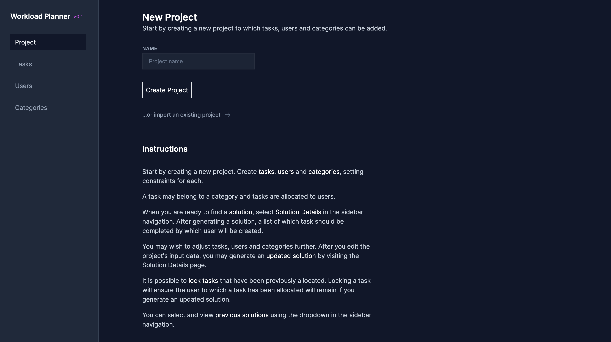
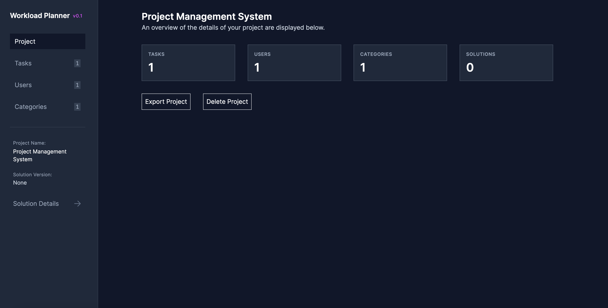
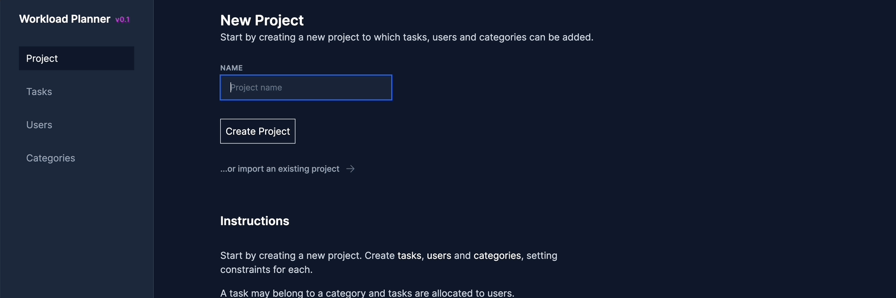
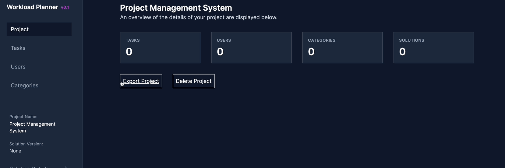

# Workload Planner

Simple user interface for workload planning paired with a backend constraint programming model to find optimal and balanced workloads for users.

Created as a dissertation project at the University of St Andrews.

## Running Instructions

Requires an environment with NodeJS and NPM installed.

1. Install dependencies

`npm install`

2. Build

`npm run build`

3. Run

`npm run start`

## User Interface

Below are some screenshots of the project UI:

### Home Page

This is the homepage with no existing project

This is the project page showing the project details

## Application Preview

### Create new project

Create a new project named **Project Management System**

Create a new category named **Planning**

Create a new task named **Design the database schema** under the **Planning** category

Create a user named **John Smith** managing the **Planning** tasks. He prefers to take over the **Design database schema** task.